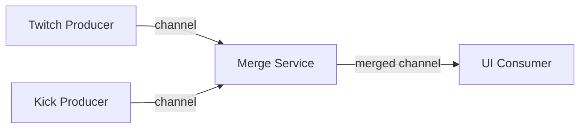

# multichat

A real time Twitch and Kick multichat client (This is an EARLY STAGE prototype)


## How It Works

The app uses a **fan in pattern** to merge multiple chat streams:



1. **Producers** (`internal/adapters/`) - Independent producers run in separate goroutines, each streaming messages on their own channel
2. **Service Layer** (`internal/service/`) - Combines all producer channels into a single unified channel
3. **UI** (`internal/ui/`) - Consumes from the merged channel and displays messages in a thread safe Fyne window

## Quick Start

```bash
make run
```

Or

```bash
make build
./multichat
```
