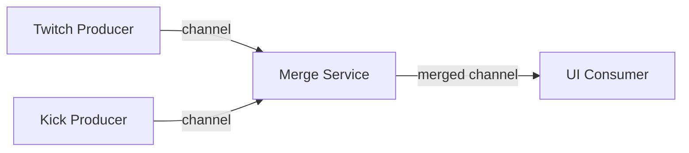

# multichat

A Twitch and Kick multichat client (WIP)


## How It Works

**Fan in pattern** to merge multiple chat streams:


```mermaid
graph LR
    TP[Twitch Producer] -->|channel| M[Merge Service]
    KP[Kick Producer] -->|channel| M
    M -->|merged channel| UI[UI Consumer]
```

**Producers** (`internal/adapters/`) - producers run in separate goroutines, each streaming messages on their own channel 
**Service Layer** (`internal/service/`) - combines all producer channels into a single unified channel 
**UI** (`internal/ui/`) - consumes from the merged channel and displays messages in a Fyne window 

## Dependencies

- **Go 1.25** 
- **fyne.io/fyne/v2** 
- **github.com/gempir/go-twitch-irc/v4** 
- **github.com/coder/websocket** 
- **go.uber.org/zap** 

Install dependencies:
```bash
go mod download
```

## Running locally 
```bash
git clone git@github.com:llan0/multichat.git
cd multichat
go mod download
make run
```

## Upcoming
- Tests 
- Send messages
- Render emotes
- Auth/credentials management
- Multiple channel support
- Settings/preferences UI
- Error recovery and handling improvements
