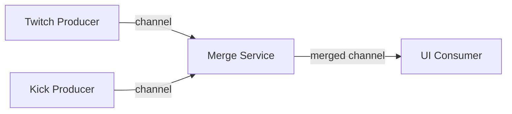

<div align="center">
  
  <h3>Multichat </h3>
  <p>  Twitch and Kick multichat client <i> (WIP)</i> </p> 
  
</div>

## Installation

**Requirements:** Go 1.25+

```bash
git clone https://github.com/llan0/multichat.git
cd multichat
make build
./multichat
```

Or run directly:
```bash
make run
```

### Usage

```bash
# Run with default channel
./multichat

# Run with specific channel
./multichat <channel>

# Show version
./multichat -version
```

## How It Works

**Fan in pattern** to merge multiple chat streams:


```mermaid
graph LR
    TP[Twitch Producer] -->|channel| M[Merge Service]
    KP[Kick Producer] -->|channel| M
    M -->|merged channel| UI[UI Consumer]
```

- **Producers** (`internal/adapters/`) - producers run in separate goroutines, each streaming messages on their own channel 
- **Service Layer** (`internal/service/`) - combines all producer channels into a single unified channel 
- **UI** (`internal/ui/`) - consumes from the merged channel and displays messages in a Fyne window 

## Dependencies

- `fyne.io/fyne/v2`
- `github.com/gempir/go-twitch-irc/v4`
- `github.com/coder/websocket`
- `go.uber.org/zap`

## Development

```bash
# Run tests
make test

# Build binary
make build

# Clean build artifacts
make clean

# Show version
make version
```

## Upcoming
- Auth management
- Send messages
- Render emotes (BBTV, 7TV, FFZ)
- Multiple channel support
